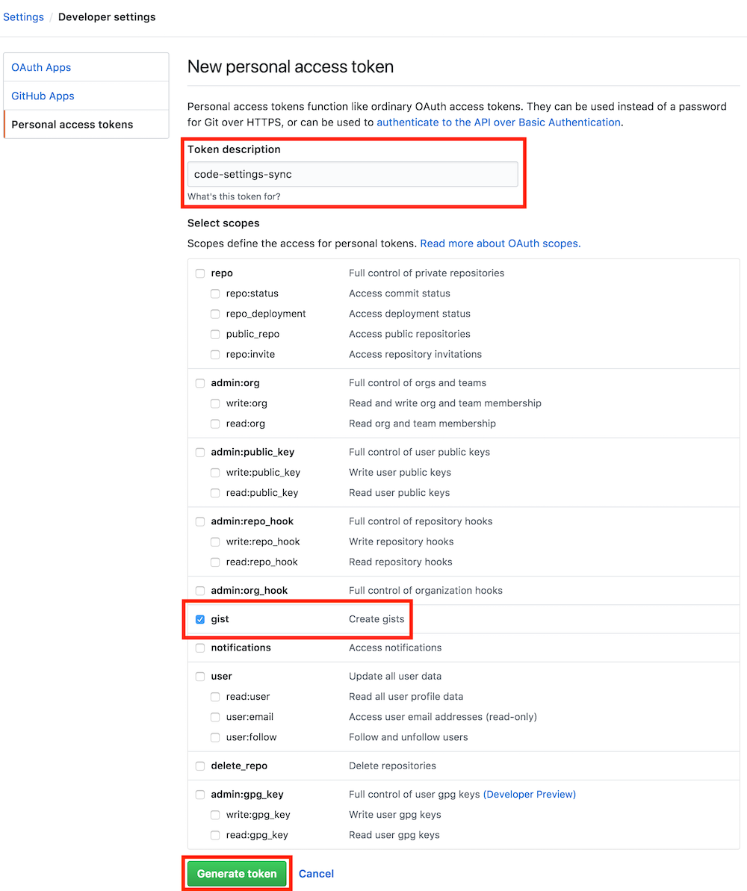
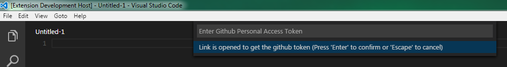

**PLUGINS VSCODE**

* Auto Rename Tag 

* Babel Javascript

* Bookmarks

* Code runner

* Debugger for chrome

* Eslint

* Javascript (ES6) code snippets

* Javascript snippet pack

* Markdown Preview Enhanced

* Markdown preview Github styling

* Markdow Shortcuts

* Material theme

* Material Theme Kit

* Open in browser

* Partial Diff     ===>

* Rainbow Brackets ===> _Differentes couleurs de parenthese et crochet_

* Settings sync   ===> _Pour syncroniser ma configuration_

* Terminal ===> _Avoir un terminal_

* VScode browser Sync

* VScode- Icons

---------------------------------------
 **Syncronisation avec le plugins Setting sync**
----------------------------------------
*Synchroniser les paramètres, les extraits, les thèmes, les icônes de fichiers, le lancement, les raccourcis clavier, les espaces de travail et les extensions sur plusieurs machines à l'aide de GitHub Gist.

  1.**Installation**

  Lancez VSCode Quick Open **(Ctrl + P)**, collez la commande suivante et appuyez sur **Entrée**.

        ext install Shan.code-settings-sync
  
  2.**Creation du token sur github**

Cette extension nécessite un (**TOKEN**) jeton d'accès personnel depuis votre compte GitHub. Vous pouvez en créer un en suivant simplement les étapes indiquées dans les images ci-dessous. Assurez-vous d'ajouter Gist dans la portée.

**Go to Settings / Developer settings / Personal access tokens / Generate New Token**


**Select Gist From Scopes.**


**Get an Access Token.**


**ATTENTION**

**Enregistrez** le TOKEN quelque part pour une utilisation future (c'est-à-dire pour télécharger à partir d'autres machines

--------------------------------------
#Uploader vos paramètres pour la première fois
-------------------------------------

Appuyez sur Shift + Alt + U, il demandera votre jeton d'accès au compte GitHub.

    Shift + Alt + U

Entrez le jeton GitHub que vous avez creer precedement dans la fenêtre et  **cliquez sur entrer**.



Une fois cela fait recuperer le **Gist ID**

**ATTENTION**
n'oubliez pas de le noter vous en aurais besoin par la suite afin de télécharger les paramètres sur d'autres machines.


____________________________________________
#Uploaper vos paramètres sur le serveur
___________________________________________
Appuyez sur **Shift + Alt + D** pour demander votre identifiant GistHub Gist.

    Shift + Alt + D


* Entrez le jeton GitHub dans la fenêtre et cliquez sur entrer


* Entrez votre identifiant Gist.

-----------------------

# Recapitulatif:
pour **uploaper** votre configuration sur le serveur gist

```
SHIFT ALT U
```

pour **telecharger** votre configuration sur le serveur gist apres une reinstaltion ou un crash

```
SHIFT ALT D
```
-------------------------------------


