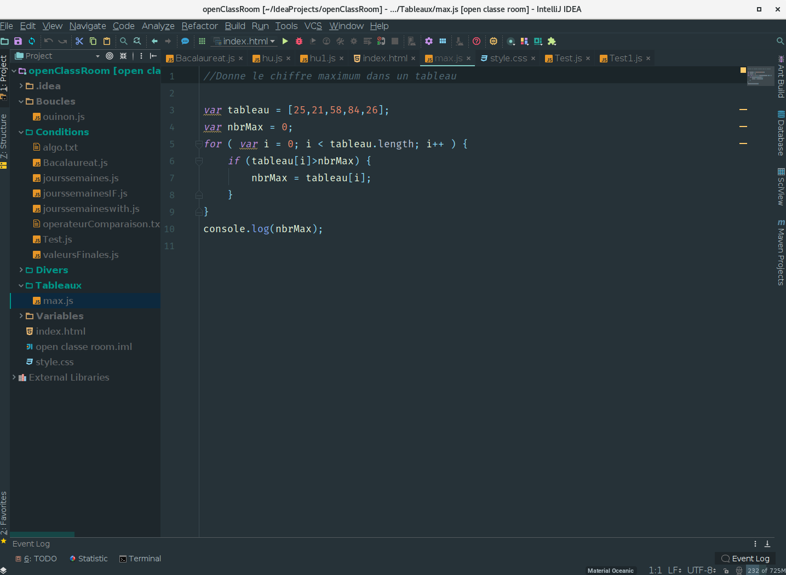
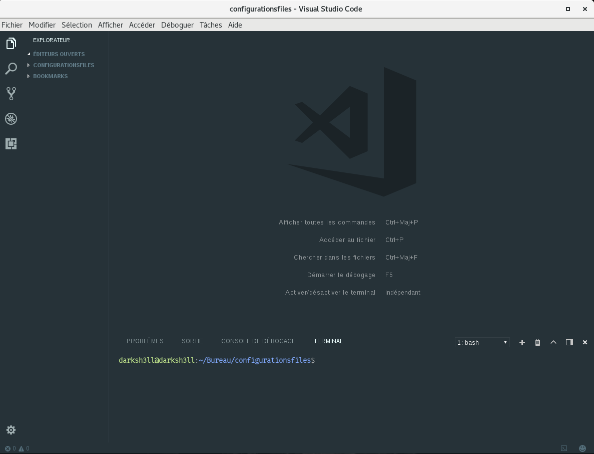

**A propos**
=============

Ce dépot me sert a enregitrer tous mes fichiers de configurations de mes editeurs de texte favories.

Voici la liste des logiciels que j'utilise.

**Distribution**
* Linux
* Mac

----------------------
**Logiciels**

1.IntellliJIDEA

2.VScode

J'utilise le theme material themes.

Vscode:
    
https://github.com/equinusocio/vsc-material-theme

intellidjJIDEA:

https://plugins.jetbrains.com/plugin/8006-material-theme-ui

