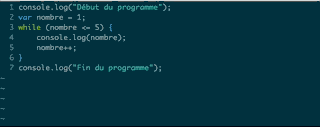

#Vim pour les programmeurs

---- 

**INSERTION**

Désignations | Raccourcies clavier | 
|--------------|-----------|
 Inséré du texte avant le curseur | i | 
 inséré du texte après curseur | a | 
 Inséré fin de ligne|A
 Inséré début de ligne|I
 Inséré en dessous | o | 
 Inséré au-dessus|O

---- 
**DÉPLACEMENT**

Désignations | Raccourcies clavier | 
|---------|----------|
 Fin de ligne | $| 
 Début de ligne |0 ou ^|
 Début du fichier | gg | 
 fin du fichier|G| 
Déplacement d'un mot vers l'avant|w| 
  Déplacement d'un mot vers l'arrière|b|
 Place le curseur à la fin du mot|e|
 Aller à la ligne N°|CTRL G|
 Déplacement vers le Haut|k|
 Déplacement vers le Bas|j|
 Déplacement vers le Gauche|h|
 Déplacement vers le Droite|L|
 
---- 
**EFFACER**

On peut combiner les touches et passer en mode insertion

exemple:

    db supprime le mot précèdent et reste en mode commande
    cb supprime le mot précèdent et passe en mode insertion.

Désignations | Raccourcies clavier | 
|---------|----------|
Efface le caractère sur le curseur | x | 
Supprime le mot précédent |db| 
efface un mot à partir du curseur jusqu'à la fin du mot | dw| 
efface un mot à partir du curseur | daw| 
efface un mot à partir du curseur et passe en mode insertion | caw| 
Efface la ligne courante | dd | 
efface jusqu'à la fin de ligne|D ou d$
efface jusqu'à début de ligne|d0(zéro) 
Supprime jusqu'à la prochaine occurrence de p|df(p)
Supprime le mot ou la phrase entre " { ( ' |di " di { ou di (

		ci ( supprime entre accolades et passe en mode insertion
		cib idem b pour block

---- 

 **MODIFIER**

Désignations | Raccourcies clavier | 
|---------|----------|
 Remplace un caractère| r | 
 Modifier un mot | cw| 
 Modifie la ligne courante | cc |
substitution de caractère efface le caractère et insère un nouveau | s |
 modifie la ligne courante | cc |

---- 

 **COPIER-COLLER**

Désignations | Raccourcies clavier | 
|---------|----------|
Copie un mot| yw | 
Copie la ligne courant | yy| 
Colle la ligne courant | p | 
 
 **SELECTIONNER**
 
|---------|----------|
Sélectionner une ligne| V | 
Sélectionner entre les parentheses| vi ( |
Sélectionner entre les accolades| vi { |
Sélectionner entre les crochet| vi [ |

---

 **RECHERCHER REMPLACER**

Désignations | Raccourcies clavier | 
|---------|----------|
Remplace la première occurrence de la ligne ou se trouve le curseur|:s/ancien/nouveau | 
Remplace toutes les occurrences de la ligne ou se trouve le curseur|:s/ancien/nouveau/g | 
Remplace toutes les occurrences dans les lignes n° # a # du fichiers|:#,#s/ancien/nouveau/g | 
Remplace toutes les occurrences dans tout le fichier|:%s/ancien/nouveau/g | 
Rechercher un mot| /motARechercher |

---- 

 **INDENTATIONS**

Désignations | Raccourcies clavier | 
|---------|----------|
Reindente tout le document|gg=G
indente la ligne|== (double égale) 
Indente a gauche| < 
Indente a Droite| > 

-------------------

 **POUR LES PROGRAMMEURS**

Désignations | Raccourcies clavier | 
|---------|----------|
Va aux accolades et parenthèses fermantes et ouvrantes |%
Sélectionne entre les parenthèses|vib 
Sélectionne entre les accolades sans les acolades|viB 
Supprime un bloc de code entre {}|daB 
passe le mot en MAJUSCULES|gUw 
passe le mot en minuscules|guw 
annuler l'action|u  
défaire|CTRL Z  
Occurrence de mot|*  
Refaire l'action précédente|.  
Incrémente le nombre sous le curseur|CTRL + a  
Décrémente le nombre sous le curseur|CTRL + x  
Entourer un mot de quotes|ciw"" ESC P 
remplace le mot entre guillemet | ci "

---

###### Deplacer une ligne:

